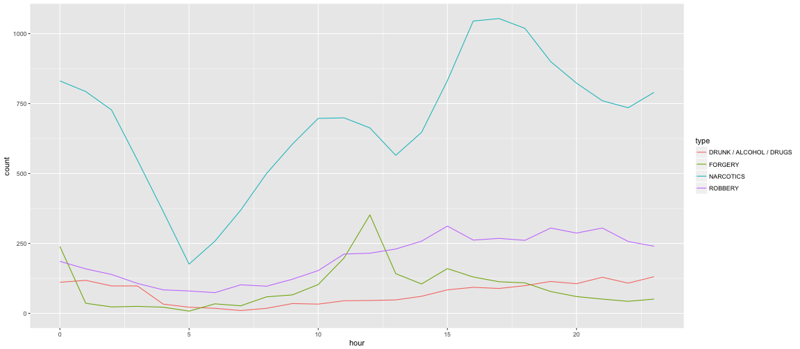

CourseProjectPitch
========================================================
author: Luke Wolcott    
date: December 18th, 2016

https://lukewolcott.shinyapps.io/courseproject/

The Question
========================================================

What types of crimes happen at what times during the day?

<em> If the LAPD were to hire three extra narcotics specialists, what hours should they work?  </em>

<em> What's the best time of day to rob a bank (since the most other robberies are happening concurrently)?  </em>


The Data
========================================================

Los Angeles County publishes data on all the crimes in the last 12 months at this site:

https://data.lacounty.gov/Criminal/LA-SHERIFF-CRIMES-LAST-12-MONTHS/ca5f-5zzs

We organize the data by the hour of day that the crime occurred, and by the type of crime.

The app user has an array of 30 checkboxes, one for each crime category.  When a category is selected, the plot shows the total number of that type of crime, by hour.

Some server.R code
========================================================

We read in the checkbox TRUE/FALSE values using a reactive function ```select_types```.

The plot is then generated by the following code.


```r
output$plt <- renderPlot({
  d <- filter(data, type %in% select_types())
  ggplot(d, aes(hour, colour=type)) 
  + geom_freqpoly(binwidth=1) 
  + xlim(0,23)
  })
```


Sample plot
========================================================


